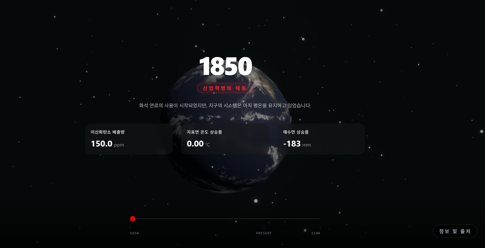
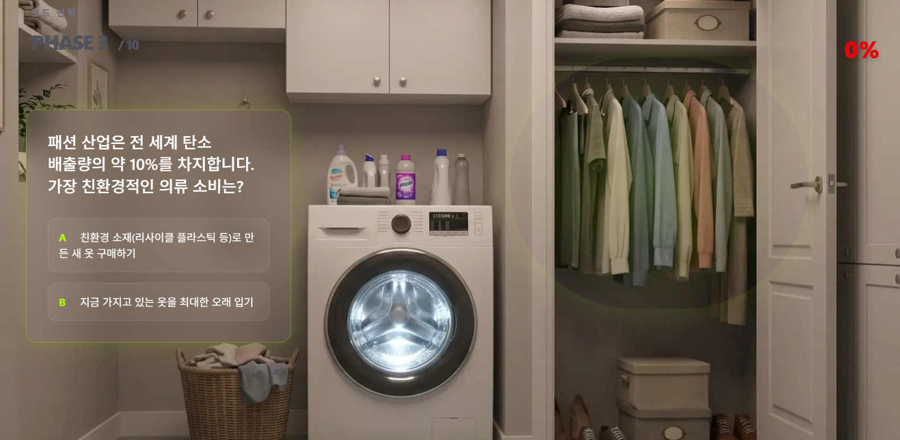
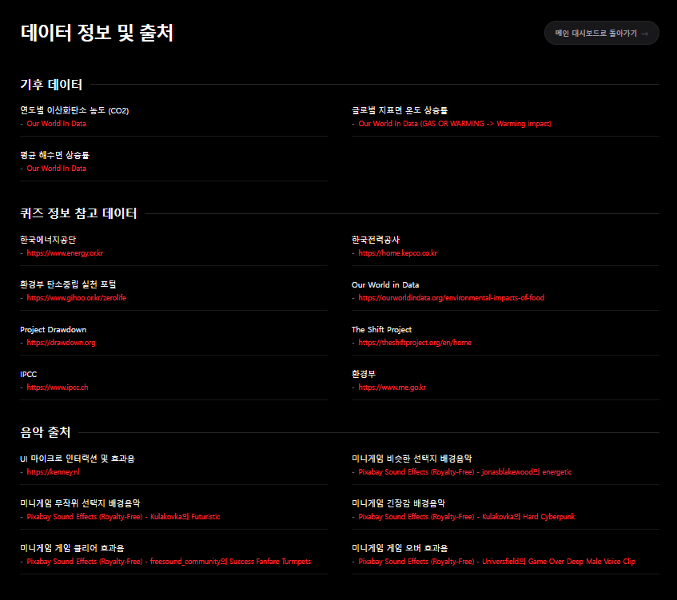

# 🌍 세이브 에너지 인 라이프 (Save Energy in Life)

일상 속 에너지 절약 습관을, 우주에서 바라본 지구의 변화와 2지선다 미니게임으로 자연스럽게 학습시키는 인터랙티브 웹 플랫폼입니다.

| | |
| --- | --- |
| 🔗 배포 링크 | https://savenergy-inlife.vercel.app/ |
| 👤 개발자 | 임수혁 (프론트엔드 개발, 1인 프로젝트) |

---

## 📸 스크린샷

| 메인 대시보드 | 퀴즈 미니게임 | 정보/출처 페이지 |
| --- | --- | --- |
|  |  |  |

---

## 📌 프로젝트 소개

### 기획 배경
현대 사회에서 기후 변화와 에너지 고갈 문제는 나날이 심각해지고 있으나, 다수의 대중은 일상 속 에너지 낭비와 환경오염에 대해 무감각한 상태를 유지하고 있습니다. 기존의 환경 교육 및 캠페인은 대개 텍스트 중심의 일방적인 정보 제공에 그쳐, 정보의 휘발성이 강하고 대중의 자발적인 흥미를 유발하기 어렵다는 한계가 있었습니다. 본 프로젝트는 이러한 대중적 무관심과 낮은 정보 지속성을 극복하고자 기획되었습니다.

### 개발 목적
사용자가 고도화된 비주얼 인터랙션을 거치며 자연스럽게 몰입하고, **게이미피케이션(Gamification)** 요소가 결합된 미니게임을 통해 에너지 절약 수칙을 자연스럽게 학습하도록 유도합니다. 궁극적으로 웹사이트 이탈 이후에도 일상 속에서 학습한 내용이 한 번이라도 더 연상되어, 실제 행동의 변화 및 실천으로 이어지게 만드는 것을 핵심 목적으로 삼습니다.

## ✨ 핵심 기능

### 메인 페이지 (Main Page): 시각적 연출과 환경적 경고
- **스토리텔링형 뷰 전환:** 일상 속 무분별한 일회용품 사용 실태 이미지에서 클로즈아웃(Close-out) 웹 애니메이션을 통해 우주 공간 속 지구의 전경으로 자연스럽게 화면을 전환합니다.
- **스크롤 동기화 데이터 시각화:** 사용자의 스크롤 트래킹 이벤트와 연동하여 이산화탄소(CO₂) 배출량, 지표면 온도 상승 폭 등의 지표를 실시간 변동 스크립트로 조작하여 시각적 경고를 전달합니다.

### 퀴즈 페이지 (Quiz Page): 미니게임 기반 체험형 학습
- **상황 몰입형 UI 디자인:** 문항 맥락과 직결되는 테마별 배경화면 및 오브젝트 강조 그래픽을 적용하고, 무작위 분기를 배정한 2지선다 인터페이스를 채택했습니다.
- **비동기 피드백 루프 및 연출효과:** 정·오답 선택 즉시 컴포넌트 내부 상태를 평가하여 애니메이션 모달을 렌더링하며, 전문적인 해설과 효과음을 제공하여 리텐션을 높였습니다.

### 정보 페이지 (Information Page): 데이터 신뢰성 확보
- **근거 기반 데이터 제공:** 메인/퀴즈 모듈에 차용된 모든 통계의 원천 소스를 명시하여 공신력을 확보했습니다.
- **상세 정보 확장성:** 외부 원천 자료로 부드럽게 이동할 수 있는 아웃바운드 링크 구조를 구축했습니다.

---

## 🛠 기술 스택

| 구분 | 기술 |
| --- | --- |
| Framework | Next.js 16 (App Router), React 19 |
| Language | TypeScript |
| Styling | Tailwind CSS v4 |
| 3D / Animation | Three.js, @react-three/fiber, @react-three/drei, @react-three/postprocessing, GSAP, Framer Motion |
| 상태 관리 | Zustand |
| 사운드 | use-sound |
| 테스트 | Vitest, React Testing Library |
| 코드 품질 | ESLint, Prettier, Husky + lint-staged |
| CI/CD | GitHub Actions (Lint · Test · Build · Lighthouse CI) |
| 배포 | Vercel |

---

## 📂 폴더 구조

```
src/
├─ app/                    # Next.js App Router 페이지
│  ├─ page.tsx             # 메인 대시보드 (/)
│  ├─ quiz/page.tsx        # 퀴즈 미니게임 (/quiz)
│  ├─ info/page.tsx        # 데이터 출처 (/info)
│  ├─ not-found.tsx        # 404 페이지
│  ├─ error.tsx            # 에러 바운더리
│  ├─ icon.tsx             # 파비콘 (동적 생성)
│  ├─ opengraph-image.tsx  # OG 이미지 (동적 생성)
│  ├─ robots.ts            # robots.txt
│  └─ sitemap.ts           # sitemap.xml
├─ components/           # UI 컴포넌트 (*.test.tsx 콜로케이트)
│  ├─ animation/         # 인트로, 카메라 워크, 파티클 등 연출 컴포넌트
│  ├─ main/              # 메인 대시보드 UI (지표 카드, 연도 슬라이더 등)
│  ├─ quiz/              # 퀴즈 미니게임 UI (홀로그램 카드, 피드백, 결과 화면 등)
│  └─ info/              # 정보 페이지 애니메이션 컴포넌트
├─ data/                 # 정적 데이터 (퀴즈 문항, 타임라인, 출처, 액션 데이터)
├─ hooks/                # 커스텀 훅 (*.test.ts 콜로케이트)
├─ store/                # Zustand 전역 상태 (게임 진행, 인트로 단계)
├─ lib/                  # 공통 상수/유틸 (배포 URL 등)
└─ types/                # 도메인별 타입 정의
```

---

## 🚀 시작하기

```bash
# 1. 저장소 클론
git clone https://github.com/imsoohyeok/Anthropocene.git
cd Anthropocene

# 2. 의존성 설치
npm install

# 3. 개발 서버 실행 (http://localhost:3000)
npm run dev
```

그 외 주요 스크립트:

```bash
npm run build   # 프로덕션 빌드
npm run start   # 빌드 결과 실행
npm run lint    # ESLint 검사
npm run test    # Vitest 유닛테스트 실행
```

---

## 🩹 트러블슈팅 / 기술적 의사결정

### 1. 화면 비율에 따라 스포트라이트 좌표가 화면 밖으로 밀려나는 문제
퀴즈 배경은 항상 16:9 비율로 화면을 꽉 채우도록(`cover`) 계산되어 있고, 특정 사물을 강조하는 스포트라이트는 그 16:9 박스를 기준으로 한 퍼센트 좌표(`left: 80%` 등)로 위치를 잡습니다. 문제는 세로로 긴 모바일 화면에서 이 박스가 화면 폭의 최대 3~4배까지 확대되어야 세로를 다 채울 수 있다는 점이었습니다 — 그 결과 화면 중앙의 아주 좁은 영역만 보이게 되고, 좌표가 33% 이상 떨어진 오브젝트(냉장고, 이동수단 등)는 완전히 화면 밖으로 밀려났습니다. 배경 확대 비율 자체를 조정하면 좌표 체계가 통째로 어긋나는 트레이드오프가 있어, 최종적으로는 배경은 기존 확대(cover) 방식을 유지하되 **스포트라이트 강조 효과 자체를 태블릿 가로 이하 화면에서는 숨기는** 방향으로 절충했습니다.

### 2. 빠르게 연속 클릭(광클)하면 문제/화면이 건너뛰어지는 버그
실제로 로컬에서 빠르게 연속 클릭하며 테스트하던 중 "문제 몇 개가 그냥 넘어가버린다"는 현상을 발견했습니다. 재현하고 원인을 추적해보니, **화면이 전환되는 짧은 순간에도 이전 상호작용이 새 화면에 그대로 반영된다**는 같은 패턴의 버그가 서로 다른 3곳에 겹쳐 있었습니다.

- **선택지 버튼**: 새 질문으로 전환된 직후에도 이전 화면에서 이어진 클릭이 새 선택지 버튼에 바로 꽂혀, 읽지도 않은 문제의 답이 자동으로 제출됨 → 질문이 바뀐 뒤 300ms 동안 클릭을 막는 가드 추가
- **"다음 문제" 버튼**: 정답/오답 모달이 `AnimatePresence`로 닫히는 0.3초 동안 버튼이 여전히 클릭 가능한 상태로 남아있고, 그 버튼은 닫히기 직전의 정답 여부를 그대로 기억하고 있어 같은 결과로 문제가 연속으로 건너뛰어짐 → 한 번 처리된 답변은 같은 버튼이 다시 눌려도 무시하도록 `ref` 기반 가드 추가
- **게임오버/클리어 화면 버튼**: `opacity: 0`으로 등장 애니메이션을 시작하는데, 애니메이션이 끝나기 전에도 이미 클릭은 가능한 상태라 화면 전환 직후 이어지는 클릭이 결과 화면 버튼을 미리 눌러버림 → 버튼이 실제로 보이기 시작하는 시점까지 `disabled` 처리

세 곳 모두 수정과 함께 `vi.useFakeTimers()`를 활용한 회귀 테스트를 추가해, 같은 버그가 다시 생기면 테스트가 바로 잡아내도록 했습니다.

### 3. 로컬에서는 되는데 CI에서만 실패하는 유닛테스트
로컬(Windows)에서는 멀쩡한데 GitHub Actions(Linux)의 유닛테스트 스텝만 실패하는 상황을 겪었습니다. 원인은 두 겹이었습니다.

- `package-lock.json`을 재생성할 때 `node_modules`는 지우지 않고 설치해서, Vitest가 내부적으로 쓰는 `rolldown`의 리눅스용 네이티브 바이너리가 lockfile에 제대로 기록되지 않는 npm의 알려진 버그([npm/cli#4828](https://github.com/npm/cli/issues/4828))에 걸림
- 이를 고치려고 `node_modules`까지 지우고 완전히 새로 설치하자, 이번엔 npm 11.0.0 자체의 내부 버그(peer dependency 트리 계산 중 크래시)에 걸림 → npm을 패치 버전(11.19.1)으로 올려 우회

고친 뒤에는 실제 CI가 쓰는 `npm ci` 명령으로 로컬에서 그대로 재현/검증하고 나서 푸시했습니다.

### 그 외 진행한 유지보수
- zustand로 상태 관리를 마이그레이션하며 남아있던, 아무 데서도 쓰이지 않는 중복 게임 로직(`useQuizEngine` 훅)과 `lucide-react` 의존성을 발견해 정리
- `npm audit`에서 발견된 Next.js의 critical 등급 보안 취약점(인증되지 않은 RCE)에 대응해 16.3.4로 업그레이드

---

## 📄 라이선스
All assets belong to their respective owners. 데이터 출처는 [/info](https://savenergy-inlife.vercel.app/info) 페이지에서 확인할 수 있습니다.
